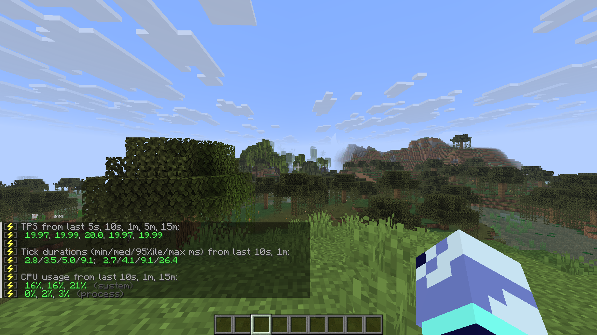

# Minecraft Paper Server Setup

Configuration and scripts for a **Paper 26.2** server, ready to deploy on Windows or a Linux VPS.
This repository contains only the configuration: the world, `.jar` files and player data are excluded (see `.gitignore`).

## Performance

Measured with `spark tps` (local test):



| Metric | Result |
|---|---|
| TPS (5s / 1m / 15m) | 19.97 / 20.0 / 19.99 |
| Tick duration (median, last minute) | 4.1 ms (limit: 50 ms) |
| Process CPU | 0–3 % |

## Contents

| File | Purpose |
|---|---|
| `server.properties` | Basic settings (port, players, view and simulation distance) |
| `bukkit.yml`, `spigot.yml`, `commands.yml` | Bukkit/Spigot configuration |
| `config/paper-global.yml`, `config/paper-world-defaults.yml` | Paper configuration |
| `start.bat` | Windows startup script |
| `start.sh` | Linux/VPS startup script with Aikar's G1 garbage collector flags |
| `backup.sh` | Compressed world backups with rotation (designed for `cron`) |
| `plugins/*/config` | Plugin configuration |

## Plugins

- **LuckPerms** — permissions and rank management.
- **CoreProtect** — block logging and rollback against griefing.
- **spark** — performance profiler (TPS, MSPT, CPU, memory).

## Deploying on a Linux VPS

```bash
# 1. Java 21+ and an unprivileged user for the server
sudo apt update && sudo apt install -y openjdk-21-jre-headless
sudo adduser --disabled-password minecraft

# 2. Clone the configuration
sudo -iu minecraft
git clone https://github.com/DegVep/minecraft-paper-setup.git server
cd server

# 3. Download Paper as server.jar (https://papermc.io/downloads) and accept the EULA
echo "eula=true" > eula.txt

# 4. Start the server (set the RAM with MEM)
MEM=4G ./start.sh
```

For daily backups at 4:00, add this to `crontab -e`:

```
0 4 * * * /home/minecraft/server/backup.sh
```

## Security

- Only open the SSH port and `25565/tcp` in the firewall.
- Never run the server as `root`.
- RCON is disabled; if you enable it, use a strong password and never commit it to the repository.
